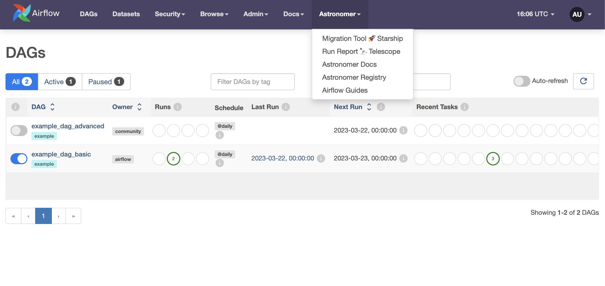
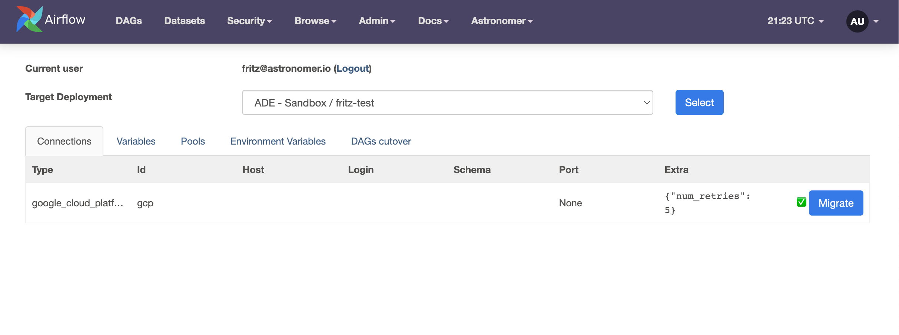
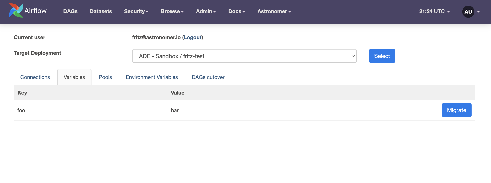
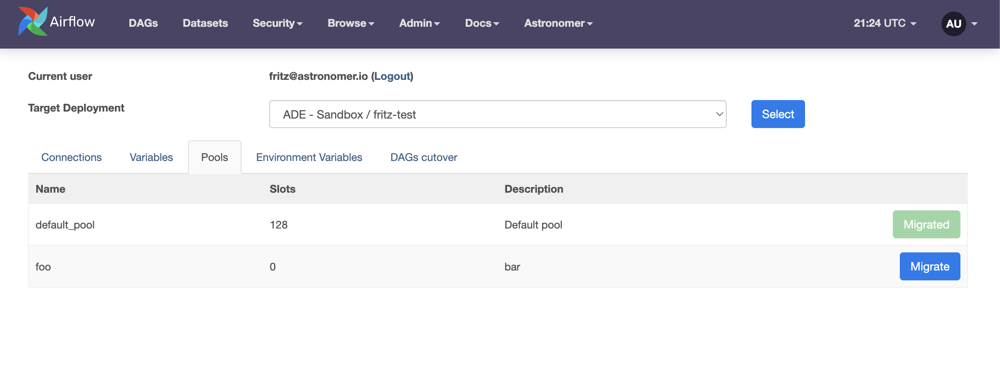
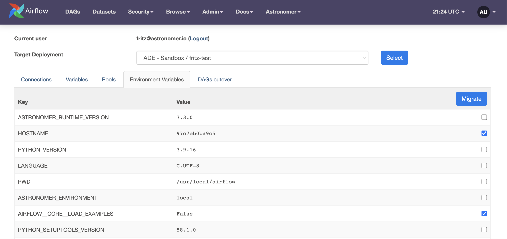

Astronomer Starship
===================
A suite of Apache Airflow utilities containing Plugins and Operators from Astronomer. The purpose of these utilities is to better assist customers migrating Variables, Connections, and Environment Variables to Astronomer hosted Airflow environments from MWAA, GCC, and OSS environments, as well as Astronomer Software and Nebula instances.

Depending on the source environment, either the Webserver Plugin or the `AstroMigrationOperator` should be used for migrating these elements.

**Note:** In order to use the Starship utilities, the source Airflow environment must be running Airflow 2.x

Choosing the right package
--------------------------
- The `AstroMigrationOperator` should be used if migrating from a Google Cloud Composer 1 (with Airflow 2.x) or MWAA v2.0.2 environment. These environments do not support webserver plugins and will require using the `AstroMigrationOperator` to migrate Connections, Variables, and Environment Variables.
- The `Starship Plugin` should be used for migrating from all other environments including Google Cloud Composer 2, MWAA v2.2.2, OSS, and Astronomer Software/Nebula instances.

Installation
------------
Installation for both the plugin and operator are the same

Install and update using `pip <https://pip.pypa.io/en/stable/getting-started/>`_:

.. code-block:: bash

    pip install astronomer-starship

Usage
-----
1. Add the following line to your ``requirements.txt`` in your source environment:

.. code-block:: bash

    astronomer-starship

2. Add the following DAG to your source environment:

.. code-block:: python

   from airflow import DAG

   from astronomer.starship.operators import AstroMigrationOperator
   from datetime import datetime

   with DAG(
       dag_id="astronomer_migration_dag",
       start_date=datetime(2020, 8, 15),
       schedule_interval=None,
   ) as dag:

       AstroMigrationOperator(
           task_id="export_meta",
           deployment_url='{{ dag_run.conf["deployment_url"] }}',
           token='{{ dag_run.conf["astro_token"] }}',
       )

3. Deploy this DAG to your source Airflow environment, configured as described in the **Configuration** section below
4. Once the DAG is available in the Airflow UI, click the "Trigger DAG" button, then click "Trigger DAG w/ config", and input the following in the configuration dictionary:

   - ``astro_token``:  To retrieve an Astronomer token, navigate to `cloud.astronomer.io/token <https://cloud.astronomer.io/token>`_ and log in using your Astronomer credentials

   - ``deployment_url``: To retrieve a deployment URL - navigate to the Astronomer Airlow deployment that you'd like to migrate to in the Astronomer UI, click ``Open Airflow`` and copy the page URL (excluding ``/home`` on the end of the URL)

     - For example, if your deployment URL is ``https://astronomer.astronomer.run/abcdt4ry/home``, you'll use ``https://astronomer.astronomer.run/abcdt4ry``

   - The config dictionary used when triggering the DAG should be formatted as:

.. code-block:: json

        {
            "deployment_url": "your-deployment-url",
            "astro_token": "your-astro-token"
        }

5. Once the DAG successfully runs, your connections, variables, and environment variables should all be migrated to Astronomer

Configuration
--------------
The ``AstroMigrationOperator`` can be configured as follows:

- ``variables_exclude_list``: List the individual Airflow Variables which you **do not** want to be migrated. Any Variables not listed will be migrated to the desination Airflow deployment.
- ``connection_exclude_list``:  List the individual Airflow Connections which you **do not** want to be migrated. Any Variables not listed will be migrated to the desination Airflow deployment.
- ``env_include_list``:  List the individual Environment Variables which you **do** want to be migrated. Only the Environment Variables listed will be migrated to the desination Airflow deployment. None are migrated by default.

.. code-block:: python

      AstroMigrationOperator(
          task_id="export_meta",
          deployment_url='{{ dag_run.conf["deployment_url"] }}',
          token='{{ dag_run.conf["astro_token"] }}',
          variables_exclude_list=["some_var_1"],
          connection_exclude_list=["some_conn_1"],
          env_include_list=["FOO", "BAR"],
      )

Running Telescope Report
------------------------
To run the Telescope Report, to get a snapshot of your source Airflow Instance

1. Hover over the Astronomer menu in the Airflow UI and select ``Run Report 🔭 Telescope``
2. Enter your Organization's Name
3. (Optionally) Enter a pre-signed URL if you were supplied one, or request one from your Astronomer representative
4. Hit "Send/Download Report"
5. If you didn't use a pre-signed URL, send the report to your Astronomer Representative.

More information about this report can be gathered from https://github.com/astronomer/telescope#what-is-it

Astronomer Starship Plugin
==========================

Starship is an Airflow Plugin meant to assist customers migrating Variables, Connections, and Environment Variables from a source Airflow to an Astro Airflow.

Initial Setup
-------------
1. Add the following line to your ``requirements.txt`` in your source environment:

.. code-block:: bash

    astronomer-starship

2. Once your source environment has ``astronomer-starship`` installed, you will see a new Astronomer menu. Hover over that menu and select the ``Migration Tool 🚀`` option

3. After opening the plugin page, you will need to authenticate to Astronomer. To do this, please:

    a. Click the ``Get Token`` button
    b. If you are prompted to sign-in to cloud.astronomer.io please do so
    c. Copy the access token that appears in the new tab
    d. Paste the access token into the ``Authentication Token`` field
    e. Click the ``Sign In`` button

4. After authenticating to Astronomer, you will need to select the deployment that you are sending metadata to. To do this, select a deployment from the ``Target Deployment`` dropdown and click the ``Select`` button

Migrating Airflow Connections
-----------------------------

To migrate connections from your source Airflow meta-database:

1.. Click on the ``Connections`` tab:
2. In the table displaying the connections that can be migrated, click the ``Migrate`` button for each connection that needs to be sent to the Target Deployment:

3. Once the ``Migrate`` button is clicked, the connection will be sent to the Target Deployment and will show as ``Migrated ✅`` in the plugin UI:

Migrating Airflow Variables
---------------------------

To migrate variables from your source Airflow meta-database:

1. Click on the ``Variables`` tab:
2. In the table displaying the variables that can be migrated, click the ``Migrate`` button for each variable that needs to be sent to the Target Deployment

#. Once the ``Migrate`` button is clicked, the variable will be sent to the Target Deployment and will show as ``Migrated ✅`` in the plugin UI

Migrating Airflow Pools
-----------------------

To migrate pools from your source Airflow meta-database:

1. Click on the ``Pools`` tab:
2. In the table displaying the pools that can be migrated, click the ``Migrate`` button for each pool that needs to be sent to the Target Deployment

3. Once the ``Migrate`` button is clicked, the pool will be created in the Target Deployment and will show as ``Migrated ✅`` in the plugin UI:

Migrating Environment Variables
-------------------------------

To migrate environment variables from your source Airflow:

1. Click on the ``Environment Variables`` tab:
2. In the table displaying the environment variables that can be migrated, ensure the checkbox is ticked for each environment variable that needs to be sent to the Target Deployment

3. Once all of the desired environment variable checkboxes have been selected, click the ``Migrate`` button in the table header
4. After clicking the ``Migrate`` button in the table header, each selected environment variable will be sent to the Target Deployment and the ticked checkbox will display ``Migrated ✅``

Utilizing DAGs Cutover Tab
--------------------------

The DAGs Cutover Tab can be utilized to pause DAGs in the source environment and unpause DAGs in the target environment (as long as the DAG id in both the source and target environment match). To do so, please:

1. Click on the ``DAGs Cutover`` tab:
2. In the table displaying the DAGs present in both the source and target environments, click the Pause ⏸️ icon under ``Local``

.. image:: images/cutover-pause-local.png

3. In the table displaying the DAGs present in both the source and target environments, click the Start ▶️ icon under ``Remote``
4. After completing this process, you will see the DAG is paused in the ``Local`` environment (a Start ▶️ Icon) and is un-paused in the ``Remote`` environment (a Pause ⏸️ icon)

License
-------

`License <LICENSE.txt>`_
