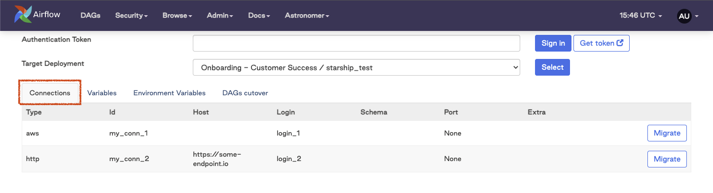
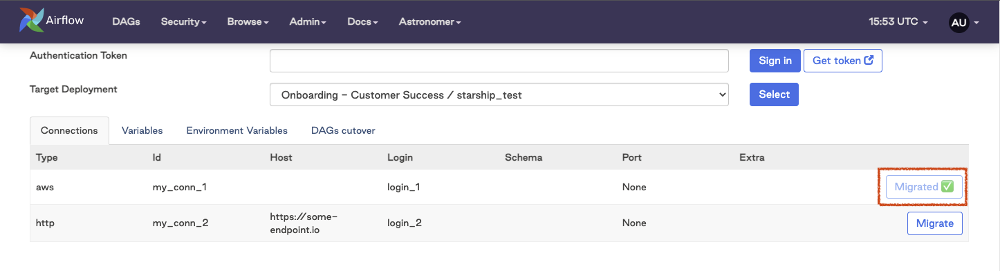
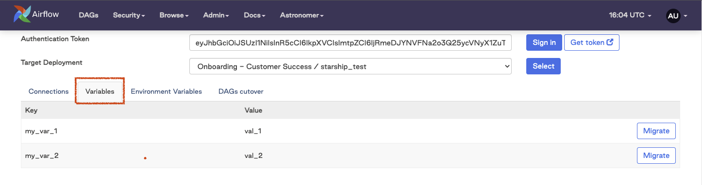
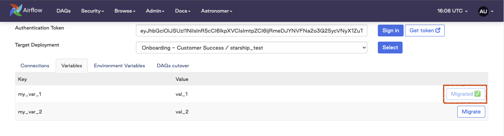
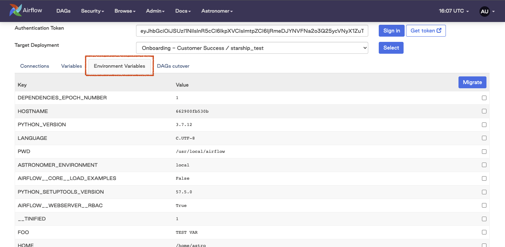
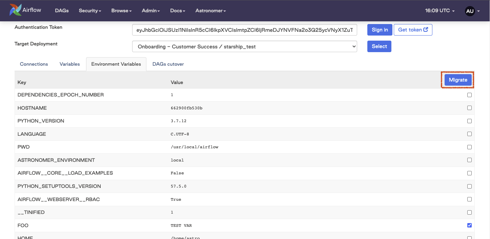
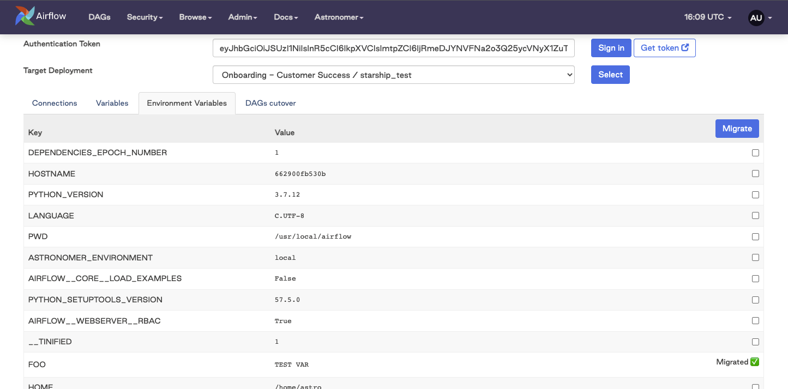

Astronomer Starship Plugin
==========================

Apache Airflow Plugin meant to assist customers migrating to Airflow managed by Astronomer from other Airflow environments.

Installation
------------

Install and update using `pip <https://pip.pypa.io/en/stable/getting-started/>`_:

.. code-block:: bash

    pip install astronomer-starship

Starship
========

Starship is an Astronomer utility that assist end users with migrating Variables, Connections, and Environment Variables from their source Airflow environments to an Astronomer environment.

Initial Setup
-------------
1. Add the following line to your ``requirements.txt`` in your source environment:

.. code-block:: bash

    astronomer-starship

2. Once your source environment installs ``astronomer-starship`` via the ``requirements.txt``, you will see a new Astronomer menu. Hover over that menu and select the ``Migration Tool 🚀`` option

.. image:: images/menu-item.png
   :width: 800

3. After opening the plugin page, you will need to authenticate to Astronomer. To do this, please:

    a. Click the ``Get Token`` button
    b. If you are prompted to sign-in to cloud.astronomer.io please do so
    c. Copy the access token that appears in the new tab
    d. Paste the access token into the ``Authentication Token`` field
    e. Click the ``Sign In`` button

4. After authenticating to Astronomer, you will need to select the deployment that you are sending metadata to. To do this, select a deployment from the ``Target Deployment`` dropdown and click the ``Select`` button

Migrating Airflow Connections
-----------------------------

To migrate connections from your source Airflow meta-database:

1. Click on the ``Connections`` tab:

2. In the table displaying the connections that can be migrated, click the ``Migrate`` button for each connection that needs to be sent to the Target Deployment:

.. image:: images/connections-migrate.png
   :width: 800

3. Once the ``Migrate`` button is clicked, the connection will be sent to the Target Deployment and will show as ``Migrated ✅`` in the plugin UI:

Migrating Airflow Variables
---------------------------

To migrate variables from your source Airflow meta-database:

1. Click on the ``Variables`` tab:

2. In the table displaying the variables that can be migrated, click the ``Migrate`` button for each connection that needs to be sent to the Target Deployment

.. image:: images/variables-migrate.png
   :width: 800

3. Once the ``Migrate`` button is clicked, the variable will be sent to the Target Deployment and will show as ``Migrated ✅`` in the plugin UI:

Migrating Environment Variables
-------------------------------

To migrate environment variables from your source Airflow:

1. Click on the ``Environment Variables`` tab:

2. In the table displaying the environment variables that can be migrated, ensure the checkbox is ticked for each environment variable that needs to be sent to the Target Deployment

.. image:: images/env-migrate.png
   :width: 800

3. Once all of the desired environment variable checkboxes have been selected, click the ``Migrate`` button in the table header

4. After clicking the ``Migrate`` button in the table header, each selected environment variable will be sent to the Target Deployment and the ticked checkbox will display ``Migrated ✅``

