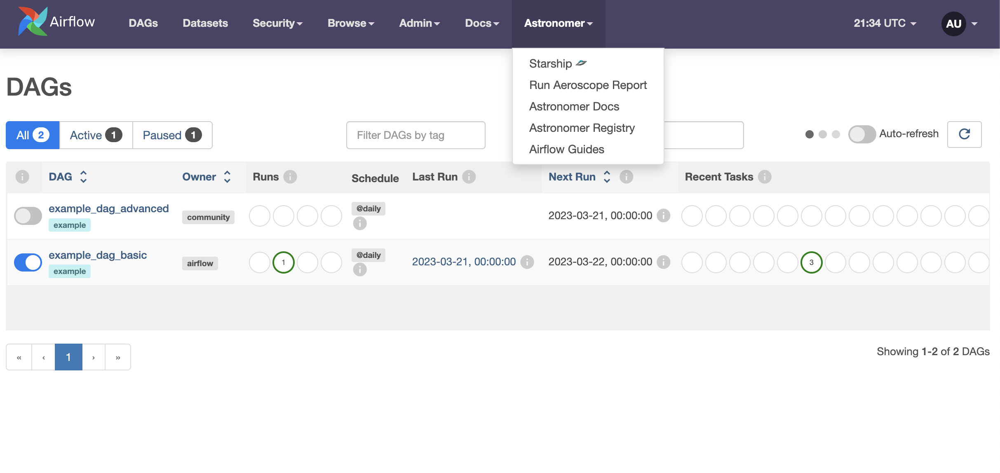
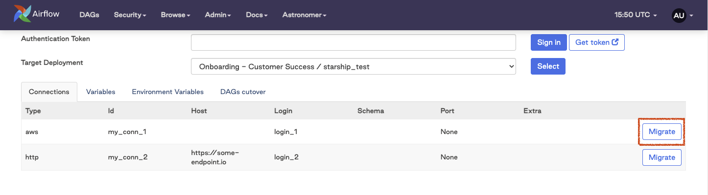
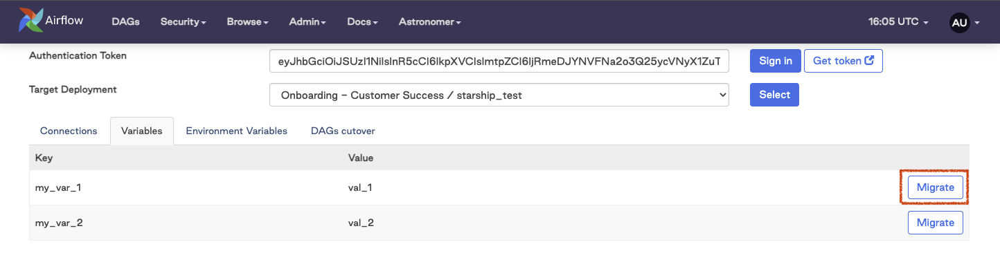
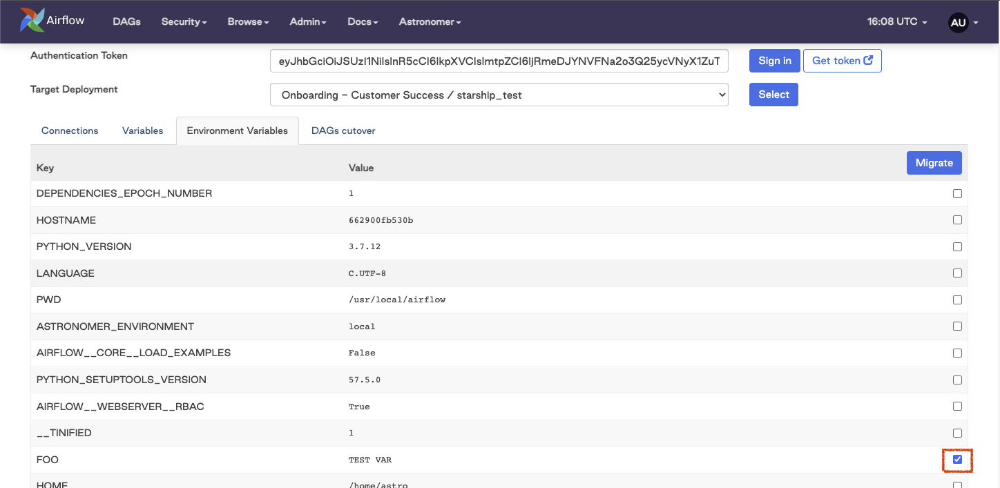
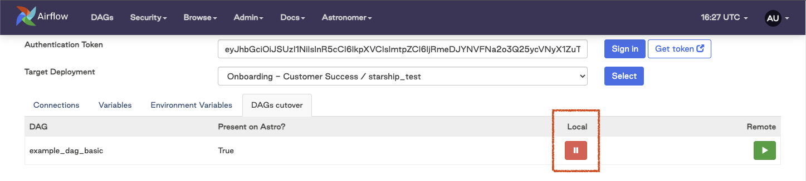

Astronomer Starship Plugin
==========================

Starship is an Airflow Plugin meant to assist customers migrating Variables, Connections, and Environment Variables from a source Airflow to an Astro Airflow.

Initial Setup
-------------
1. Add the following line to your ``requirements.txt`` in your source environment:

.. code-block:: bash

    astronomer-starship

2. Once your source environment has ``astronomer-starship`` installed, you will see a new Astronomer menu. Hover over that menu and select the ``Migration Tool 🚀`` option

3. After opening the plugin page, you will need to authenticate to Astronomer. To do this, please:

    a. Click the ``Get Token`` button
    b. If you are prompted to sign-in to cloud.astronomer.io please do so
    c. Copy the access token that appears in the new tab
    d. Paste the access token into the ``Authentication Token`` field
    e. Click the ``Sign In`` button

4. After authenticating to Astronomer, you will need to select the deployment that you are sending metadata to. To do this, select a deployment from the ``Target Deployment`` dropdown and click the ``Select`` button

Migrating Airflow Connections
-----------------------------

To migrate connections from your source Airflow meta-database:

1. Click on the ``Connections`` tab:
2. In the table displaying the connections that can be migrated, click the ``Migrate`` button for each connection that needs to be sent to the Target Deployment:

3. Once the ``Migrate`` button is clicked, the connection will be sent to the Target Deployment and will show as ``Migrated ✅`` in the plugin UI:

Migrating Airflow Variables
---------------------------

To migrate variables from your source Airflow meta-database:

1. Click on the ``Variables`` tab:
2. In the table displaying the variables that can be migrated, click the ``Migrate`` button for each variable that needs to be sent to the Target Deployment

3. Once the ``Migrate`` button is clicked, the variable will be sent to the Target Deployment and will show as ``Migrated ✅`` in the plugin UI:

.. image:: https://github.com/astronomer/starship/raw/master/astronomer-starship/images/variables-migrate-complete.png
   :width: 800

Migrating Environment Variables
-------------------------------

To migrate environment variables from your source Airflow:

1. Click on the ``Environment Variables`` tab:
2. In the table displaying the environment variables that can be migrated, ensure the checkbox is ticked for each environment variable that needs to be sent to the Target Deployment

3. Once all of the desired environment variable checkboxes have been selected, click the ``Migrate`` button in the table header
4. After clicking the ``Migrate`` button in the table header, each selected environment variable will be sent to the Target Deployment and the ticked checkbox will display ``Migrated ✅``

Utilizing DAGs Cutover Tab
--------------------------

The DAGs Cutover Tab can be utilized to pause DAGs in the source environment and unpause DAGs in the target environment (as long as the DAG id in both the source and target environment match). To do so, please:

1. Click on the ``DAGs Cutover`` tab:
2. In the table displaying the DAGs present in both the source and target environments, click the Pause ⏸️ icon under ``Local``

3. In the table displaying the DAGs present in both the source and target environments, click the Start ▶️ icon under ``Remote``
4. After completing this process, you will see the DAG is paused in the ``Local`` environment (a Start ▶️ Icon) and is un-paused in the ``Remote`` environment (a Pause ⏸️ icon)

License
-------

`License <LICENSE.txt>`_