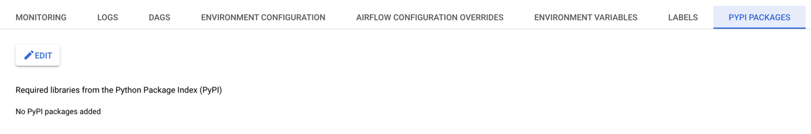
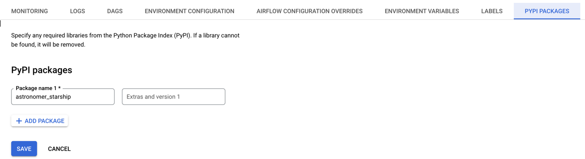

# Google Cloud Composer

## Compatability

| Source              | Compatible             |
|---------------------|------------------------|
| Airflow 1           | ❌                      |
| GCC 1 - Airflow 2.x | [Operator](./operator) |
| GCC 2 - Airflow 2.x | ✅                      |

## Notes

You must be an Admin to see Plugins on GCC.

## Installation
1. Navigate to your [Environments](https://console.cloud.google.com/composer/environments/)
2. Go to PyPi Packages
    
3. Click `+ Add Package` and put `astronomer_starship` under `Package name`
    


## FAQ
- **I'm using Google Cloud Composer 2.x and Airflow 2.x and do not see the `Astronomer` menu and/or the Starship Airflow Plugin?**

    _Run the following to ensure you are a privileged user._
    ```
    gcloud config set project <PROJECT_NAME>
    gcloud composer environments run <ENVIRONMENT_NAME> --location <LOCATION> users add-role -- -e <USER_EMAIL> -r Admin
    ```
