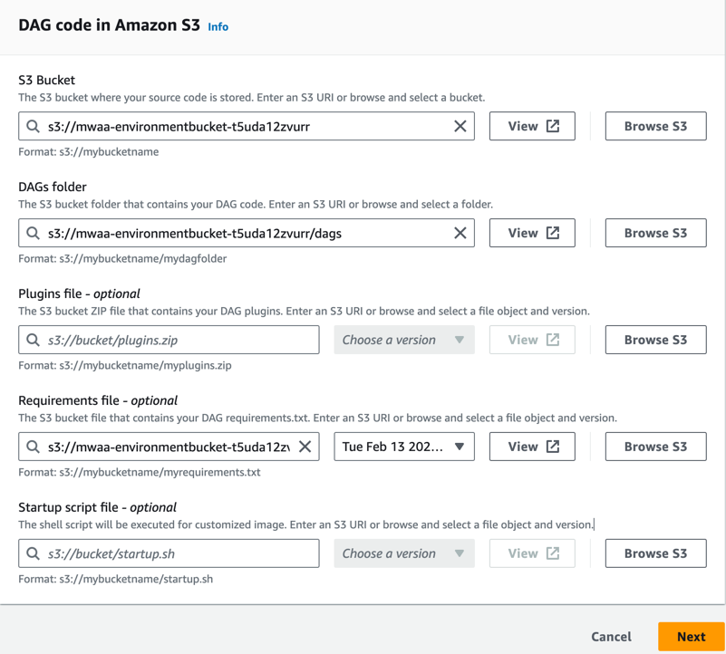

# (AWS) Managed Apache Airflow

## Compatability

| Source              | Compatible             |
|---------------------|------------------------|
| Airflow 1           | ❌                      |
| MWAA v2.0.2         | [Operator](./operator) |
| MWAA ≥ v2.2.2       | ✅                      |

## Installation
1. Navigate to your [Environments](https://console.aws.amazon.com/mwaa/home)
2. Download your existing `requirements.txt`
3. Add `astronomer_starship` to the file, save it, and re-upload it to S3
4. Click `Edit`, and pick the newer version of your Requirements File
    
5. Click `Next`, then eventually `Save`, and then wait for your deployment to restart and dependencies to install
